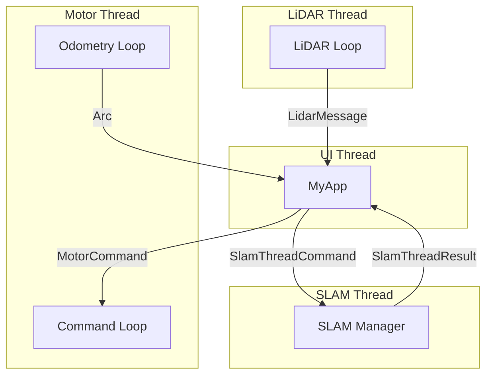

## Overall Architecture

### Overall Structure

本プロジェクトは、Rust製のGUIフレームワーク **`eframe` (egui)** をベースに構築されています。
アーキテクチャの核心は、UIを担う **メインスレッド** と、ハードウェア通信や重い計算処理を担う複数の **バックグラウンドスレッド** との非同期連携です。

```text
 [ Main Thread (UI) ] <-----------------> [ Background Threads ]
    - UI描画 (egui)                       - LiDARデータ取得
    - 状態管理 (MyApp)                    - モーター制御
    - コマンド処理                        - オドメトリ計算
    - スレッド間通信の統合                - SLAM計算
```

### Data Flow

